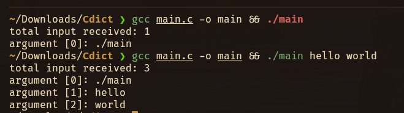

#### Hello world
```c

#include <stdio.h>

int main(int argc, char const *argv[]) {
  // argc == argument count, argument vector
  printf("total input received: %d\n", argc); // if you run ./main hello world,
                                              // argc = 3


  for (int i = 0; i < argc; i++) {
    printf("argument [%d]: %s\n", i, argv[i]); // then argv[0] = ./main, argv[1]
                                               // hello ..
  }

  return 0;
}
```





```c

#include <stdio.h>
#include <stdlib.h>

#define TYPE_NAME(x)                                                           \
  _Generic((x),                                                                \
      int: "int",                                                              \
      char *: "char *",                                                        \
      const char *: "const char *",                                            \
      default: "unknown")

int main(int argc, char const *argv[]) {
  printf("ARG count is: %d\n", argc);

  if (argc < 1) {
    printf("please enter format like [./main something]\n");
    return -1;
  }

  // converts number string to int
  printf("number type before conversion is: %s\n", TYPE_NAME(argv[1]));
  int number = atoi(argv[1]);
  printf("number type before conversion is: %s\n", TYPE_NAME(number));

  if (number < 3) {
    printf("Please type a bigger number!! \n");
    return -1;
  }

  printf("Yay!!!!\n");

  return 0;
}
```

Run with:
```bash
gcc main.c -o main && ./main 3
```


#### struct
```c
#include <stdio.h>
#include <string.h>

struct car {
    char *name;
    float price;
    int speed;
};

struct Person {
    char name[10];
    int age;
};

struct Man {
    char *name;
    int age;
    int height;
};

void set_speed(struct car *c, int speed) {
    // That won't work because the dot operator only works on structs... it
    // doesn't work on pointers to structs.
    // c.speed = speed;
    // (*c).speed = speed; // works but ugly
    c->speed = speed;
}

int main(void) {
    struct Person p1;
    p1.age = 9;
    char *myName = "jude";
    strcpy(p1.name, myName);
    printf("my name is %s\n", p1.name);

    // assign char* member directly (no copy needed, just points to literal)
    struct Man m1;
    m1.name = "jude okafor";
    m1.age = 90;
    printf("my name is %s, and age is %d\n", m1.name, m1.age);

    // struct initializer (positional)
    struct Person p2 = {"james", 14};
    printf("my name is %s\n", p2.name);

    // designated initializer (named fields, order doesn't matter)
    struct Man m3 = {.age = 14, .name = "james"};
    printf("my name is %s, age is %d, height is %d\n", m3.name, m3.age,
           m3.height); // missing fields like height are initialized with 0

    // pass struct pointer to function
    struct car c1 = {.name = "bugatti", .price = 2.4f};
    set_speed(&c1, 8); // speed is int, so pass an int not a float
    return 0;
}
```


### Read from file, use read a single character
```c

#include <stdio.h>
#include <string.h>

int main(void) {

    // The spec refers to these as streams, i.e. a stream of data from a file or
    // from any source.
    FILE *fp;
    int c;

    fp = fopen("hello.txt", "r"); // open file for reading
    if (fp == NULL) {
        printf("File not found \n");
        return 1;
    }

    // EOF. This is what fgetc() will return when the end of the file has been
    // reached and you’ve attempted to read another character.

    // int c = fgetc(fp); // read a single character
    // printf("%c\n", c); // print character to stdout

    while ((c = fgetc(fp)) != EOF) {
        printf("%c", c);
    }
    fclose(fp); // close file when done

    // stdin 	Standard Input, generally the keyboard by default
    // stdout 	Standard Output, generally the screen by default
    // stderr 	Standard Error, generally the screen by default, as well

    // printf("Prints to console\n");
    // fprintf(stdout, "Prints to file");
}
```


### FILE using fgets 
```c
#include <stdio.h>
#include <string.h>

int main(void) {

    FILE *fp;
    char s[1024]; // Big enough for any line this program will encounter
    int linecount = 0;

    fp = fopen("hello.txt", "r");
    if (fp == NULL) {
        printf("File not found \n");
        return 1;
    }

    while (fgets(s, sizeof s, fp) != NULL) {
        printf("%d: %s", ++linecount, s);
    }
    fclose(fp);
}
```
